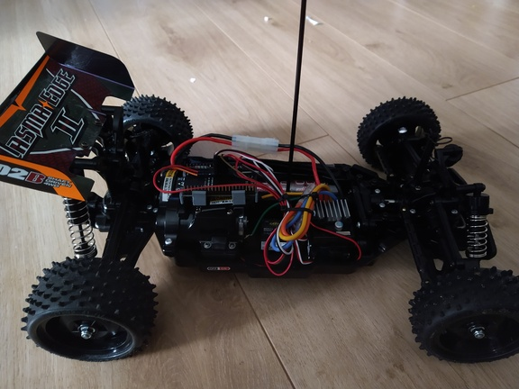

# Model Car remote controller

This project reads input signals from a standard model car receiver and forwards them to servo and motor control. To enable the usage of a grown-up model car by children, the ratio between input and output can be adapted as well as offsets and limits.

How to configure:
* connect with your mobile device to the WiFi AP and you should get a welcome page directly opened (captive site)
* if not, access http://[YOUR CONFIGURED IP]/ 

Needed Hardware:
* EPS32S2 NodeMCU (e.g. EPS32-S2 Saola)
* a model car controlled by two PWM signals
* a WiFi device to access to configuration webserver

Configuration:
* use idy.py menuconfig to set parameters (e.g. WiFi Password, ...)
* to use the captive site feature, it is important to set the max http request header length(HTTPD_MAX_REQ_LEN) and the max http uri length(HTTPD_MAX_URI_LEN) to something big (I used 16384 & 8192). This can be done in the menuconfig tool (or directly in sdkconfig).

Software:
* ESP-IDF Package
* Visual Studio Code (with dev container support)

